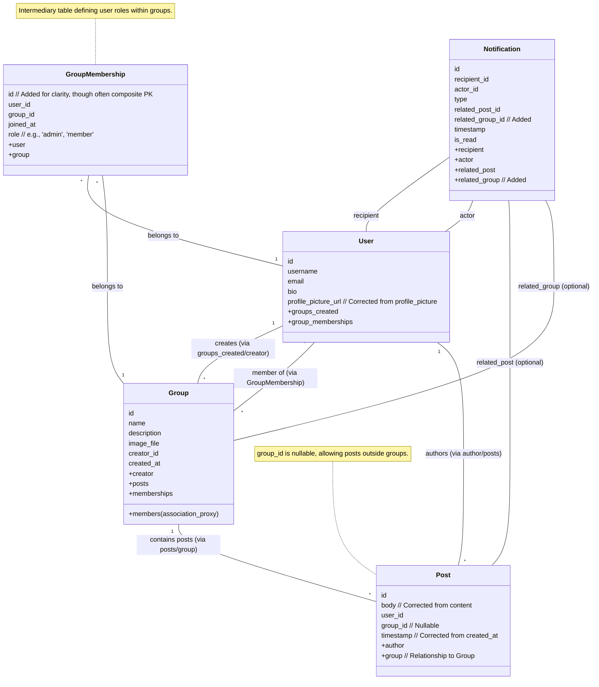

# Flask Social Platform

A social media platform built with Flask, featuring user authentication, profiles, content posting, user following, likes, comments, and real-time chat. The application also features a refreshed, modern user interface, advanced search, theme customization, and integrations for live streaming and external content sharing (currently in placeholder state).

## Features

*   User registration (username, email, password)
*   User login and logout functionality
*   Secure password hashing (using passlib with sha256_crypt)
*   User profile pages displaying username, email, bio, and profile picture
*   User profile editing:
    *   Update biography
    *   Upload new profile picture (supports JPG, PNG, JPEG)
*   **User Interface & Experience:**
    *   Modern, responsive UI built with Bootstrap 4.5.2 and a custom theme.
    *   Improved visual styling for enhanced readability and aesthetics.
    *   Intuitive navigation and user flows.
*   **Content Posting & Organization:**
    *   Users can create and share text-based posts, optionally including images and videos.
    *   **Hashtag Support:**
        *   Posts can be tagged with hashtags (e.g., `#Flask`, `#PythonTips`) to improve content discoverability.
        *   Hashtags are automatically parsed from the post body.
        *   Clicking on a hashtag displays a feed of all posts associated with that tag.
*   **Following System:**
    *   Users can follow and unfollow other users.
    *   Personalized feed on the homepage displaying posts from followed users and own posts.
*   **Post Engagement & Notifications:**
    *   **Likes & Comments:**
        *   Users can like and unlike posts.
        *   Like counts are displayed for each post.
        *   Users can add comments to posts.
        *   Comments are displayed chronologically under each post, showing the author and timestamp.
    *   **Notification System:** Users receive real-time notifications for:
        *   New likes on their posts.
        *   New comments on their posts.
        *   New followers.
        *   New chat messages.
        *   **Like Milestones:** Automatic notifications when a user's post reaches specific like count milestones (e.g., 10, 50, 100, 250, 500, 1000 likes), celebrating its popularity.
*   **User Groups/Communities:**
    *   Users can create and join groups based on shared interests, hobbies, or any other criteria.
    *   **Group Creation:** Create new groups with a unique name, description, and an optional group image. The creator automatically becomes an admin.
    *   **Joining & Leaving:** Users can easily join public or discoverable groups and leave groups they are part of.
    *   **Group-Specific Feeds:** Each group has its own dedicated page displaying posts made exclusively within that group, as well as posts shared to the group by its members.
    *   **Group Membership Visibility:** View a list of members for each group.
    *   **Group Management (for Admins):**
        *   Edit group details (name, description, image).
        *   Remove members from the group.
        *   Delete the group entirely (posts within the group will be disassociated).
    *   **Notifications:** Members receive notifications for new posts and shares within their groups, and group admins are notified when new users join.
*   **Real-time Chat:** (See dedicated section below for more details)
    *   One-on-one conversations.
    *   Real-time messaging with Socket.IO.
    *   **Typing Indicators:** See when other users are typing.
    *   **Read Receipts:** "Sent" and "Read" statuses for messages.
    *   Basic emoji support.
*   **Search Functionality (Enhanced):**
    *   Easily find content across the platform using the search bar.
    *   Search results include relevant user profiles, posts, groups, and hashtags.
    *   **Advanced Filtering:** Filter search results by category (All, Users, Posts, Groups, Hashtags).
    *   **Sorting Options:** Sort results by Relevance, Date, or Popularity (varies by category, e.g., follower count for users, likes/comments for posts).
    *   The search is case-insensitive.
*   **Stories**:
    *   Share temporary photo or video updates that disappear after 24 hours.
    *   Users can create new stories with media and captions via the `/story/create` page.
    *   View a feed of active stories from followed users and own stories on the `/stories` page, styled with custom CSS and basic JS interaction.
*   **Polls & Surveys**:
    *   Create interactive polls to gather opinions. Polls include a question and multiple customizable options.
    *   Users can vote on polls (AJAX-based), with logic to prevent multiple votes or allow changing a vote. Poll results are displayed with vote counts and percentages.
    *   Polls can be standalone, contextually linked to groups (e.g., created from a group page or when creating a post for a group), or conceptually linked to posts.
    *   Notifications are sent for new polls to relevant users (group members or followers).
### Post Sharing
- Users can share posts from other users to their own personal feed.
- **Sharing to Groups:** Posts can also be shared directly to groups that the user is a member of.
    - When a post is shared to a group, it appears in the group's dedicated feed, intermingled with direct posts to the group, sorted chronologically.
    - The shared post is clearly attributed with "Shared by [User] on [Timestamp]" above the original post content.
    - Members of the group (excluding the sharer) receive a notification when a new post is shared to the group.
- When a post is shared (either to a personal feed or a group), a `Share` record is created, linking the sharer, the original post, and (if applicable) the target group.
- The original author of the post receives a notification when their post is shared (regardless of whether it was to a personal feed or a group, unless they are the one sharing their own post).
- Shared posts on personal feeds are attributed to the user who shared them and are ordered chronologically based on the share time.
- This functionality is implemented via the `Share` model, a `POST /post/<post_id>/share` route (which now accepts an optional `group_id`), a "Share" button on posts, and updates to feed generation logic for both personal and group feeds.
*   CSRF Protection for forms.
*   Default profile picture for new users.
*   Unit tests for core features including authentication, profiles, posts, groups, chat, search, stories, and polls.

### Events/Calendar
*   **Purpose:** Allows users to create, discover, join, and manage events, fostering real-world interactions and community engagement.
*   **Key Functionalities:**
    *   Create new events with details such as name, description, start/end date & time, and location.
    *   View a comprehensive list of all upcoming and past events.
    *   Access detailed information for each specific event.
    *   Users can join events they are interested in and leave events they can no longer attend.
    *   Event organizers have the ability to edit or delete the events they've created.
    *   Attendees and organizers receive notifications for important event updates, cancellations, and when new users join an event.

### Analytics Dashboard
*   **Purpose:** Provides users with a personal dashboard to view insights into their activity and engagement on the platform.
*   **Key Statistics Displayed:**
    *   Total number of posts created by the user.
    *   Total number of likes received across all their posts.
    *   Total number of comments received on all their posts.
    *   Current count of users following them (Followers).
    *   Current count of users they are following (Following).
    *   A list of their top 5 most liked posts.
*   **Visualizations:**
    *   Charts are used to visually represent data, such as a bar chart for likes per post (top 5) and a simple bar chart for the current follower count. (Note: Follower growth over time is a placeholder for future data collection).

## Performance Optimizations

To enhance the user experience and ensure the platform runs efficiently, several performance optimization techniques have been implemented:

*   **Caching:**
    *   **Flask-Caching** is utilized for server-side caching.
    *   An **in-memory cache (`SimpleCache`)** is primarily used, suitable for single-instance deployments. For multi-instance deployments, a distributed cache like Redis or Memcached would be recommended.
    *   **Cached Components:**
        *   **Routes:** Several frequently accessed routes, such as the main index page (`/`), user profiles (`/user/<username>`), and group view pages (`/group/<group_id>`), are cached to reduce database load and response times. Timeouts are configured based on the expected rate of change for the content (e.g., 5 minutes for general feeds, 1 hour for user profiles).
        *   **Database Queries:** Specific database query results, like the `followed_posts()` method in the `User` model, are cached to avoid redundant database hits for common data retrievals.
        *   Cache invalidation is implemented where necessary, for example, a user's profile cache is cleared when their profile information is updated.

*   **Database Optimization:**
    *   **Indexes:** Strategic database indexes have been added to frequently queried columns in models like `Post` (e.g., `user_id`), `Notification` (e.g., `recipient_id`, `actor_id`), and `ChatMessage` (e.g., `conversation_id`, `sender_id`). This significantly speeds up data retrieval operations.
    *   **Query Optimization:** The `followed_posts()` method, which generates the main feed for authenticated users, has been optimized to use efficient SQL joins and now supports pagination to load data in manageable chunks.
    *   **User Analytics Table:** A dedicated `UserAnalytics` table has been introduced to store pre-calculated aggregates like total likes and comments received by each user. This avoids expensive on-the-fly calculations on high-traffic pages like user profiles or analytics dashboards. These analytics are updated periodically (currently via a manual trigger, but designed for a scheduled task).

*   **Image and Media Handling:**
    *   **Image Compression:** The **Pillow** library is used to compress uploaded images.
        *   Profile pictures are resized to 256x256 pixels.
        *   Post images are resized if they exceed a maximum width (currently 800px), maintaining aspect ratio.
        *   All processed images are saved with optimization flags and a quality setting of 85% to balance file size and visual quality.
    *   **Lazy Loading:** `` tags across various templates (posts, profiles, group pages, stories, search results) now use the `loading="lazy"` attribute. This native browser feature defers the loading of off-screen images until the user scrolls near them, improving initial page load times and reducing bandwidth consumption.
    *   **Video Preloading:** For videos in stories, the `preload="metadata"` attribute is used on `<video>` tags, which instructs the browser to load only the video's metadata (like dimensions and duration) initially, rather than the entire video file.

These optimizations contribute to a faster, more responsive, and scalable platform.

## Real-time Chat

The platform includes a real-time chat feature allowing users to engage in one-on-one conversations.

**Key Chat Features:**

*   **One-on-one Conversations:** Users can initiate private chats with other users.
*   **Real-time Messaging:** Messages are sent and received instantly without needing to refresh the page, powered by Flask-SocketIO.
*   **Typing Indicators:** Users can see when the other person in the conversation is typing a message.
*   **Read Receipts:** Sent messages display "✓ Sent" status, which updates to "✓ Read" when the recipient has viewed the message.
*   **Emoji Support (Basic):** A simple emoji picker allows users to insert common emojis into their messages.
*   **Message History:** Past messages in a conversation are loaded and displayed.
*   **Notifications:** New chat messages trigger real-time notifications for the recipient (integrated with the existing notification system).

**Chat Screenshots:**

*   **Conversation List View:**
    `[Screenshot of Conversation List]`
    *Description: Shows a list of active conversations for the logged-in user, typically ordered by the most recent activity.*

*   **Chat View:**
    `[Screenshot of Chat View]`
    *Description: Displays the message history with another user. Features include dynamically grouped messages, typing indicators when the other user is active, and read receipts for sent messages.*

*   **Chat View with Emoji Panel Open:**
    `[Screenshot of Chat View with Emoji Panel]`
    *Description: Shows the emoji panel open, allowing users to easily select and insert emojis into their chat messages.*

## Frontend Technologies & Styling

The frontend of this platform is built using:

*   **Flask Templates (Jinja2):** For dynamic HTML rendering.
*   **Bootstrap 4.5.2:** As the core CSS framework for layout, components, and responsiveness. Bootstrap is integrated via CDN.
*   **Custom Modern Theme:** Applied via `app/static/css/style.css`, this theme includes:
    *   A unique color palette.
    *   The "Lato" Google Font for typography.
    *   Customized styling for Bootstrap components (cards, buttons, forms) to create a distinct look and feel.
*   **JavaScript & Socket.IO Client:** For real-time features like chat, notifications, typing indicators, and read receipts.

## Screenshots

*(Coming Soon: The following screenshots will demonstrate key features of the application.)*

*   User Registration and Login
*   User Profile Page
*   Content Feed
*   Creating a Post
*   Post Engagement
*   *(Chat screenshots are now in the dedicated "Real-time Chat" section)*

## Getting Started

Follow these instructions to get a copy of the project up and running on your local machine for development and testing purposes.

### Prerequisites

*   Python 3.8 or higher
*   pip (Python package installer)
*   git (for cloning the repository)

### Setup

1.  **Clone the repository**:
    ```bash
    git clone <your_repository_url_here>
    cd <repository_directory_name>
    ```
    *(Replace `<your_repository_url_here>` and `<repository_directory_name>` with the actual URL and directory name if you are cloning this from a remote repository. If working locally, you can skip this step or adjust as needed.)*

2.  **Create and activate a virtual environment**:
    ```bash
    python3 -m venv venv
    ```
    On Linux/macOS:
    ```bash
    source venv/bin/activate
    ```
    On Windows:
    ```bash
    venv\Scripts\activate
    ```

3.  **Install dependencies**:
    Make sure your virtual environment is activated, then run:
    ```bash
    pip install -r requirements.txt
    ```

4.  **Configuration (Optional)**:
    *   The application uses configurations defined in `config.py`.
    *   A default `SECRET_KEY` is provided for development. For production, this should be set to a secure, random value, preferably via an environment variable.
    *   The database is configured to use SQLite (`app.db`) by default. The `SQLALCHEMY_DATABASE_URI` in `config.py` can be modified to use other databases like PostgreSQL or MySQL.
    *   The `UPLOAD_FOLDER` for profile pictures is set to `app/static/images/`.
    *   `POST_IMAGES_UPLOAD_FOLDER` for images attached to posts is `app/static/post_images/`.
    *   `VIDEO_UPLOAD_FOLDER` for videos attached to posts is `app/static/videos/`.
    *   `UPLOAD_FOLDER_GROUP_IMAGES` for group images is `app/static/group_images/`.
    *   `STORY_MEDIA_UPLOAD_FOLDER` for story media (images/videos) is `app/static/story_media/`. This path can be customized in `config.py` (defaults are provided).

### Running the Application

1.  Ensure your virtual environment is activated.
2.  From the project root directory, run the application:
    ```bash
    python3 run.py
    ```
3.  The application will typically be available at `http://127.0.0.1:5000/`. Open this URL in your web browser.

### Running Tests

1.  Ensure your virtual environment is activated and development dependencies are installed.
2.  From the project root directory, run the tests:
    ```bash
    python3 -m unittest discover tests
    ```
    This command will discover and run all tests located in the `tests` directory.

## Project Structure
```
/
├── app/                  # Main application package
│   ├── static/           # Static files (CSS, JS, images)
│   │   ├── css/
│   │   ├── js/           # JavaScript files (e.g., chat_page.js, notifications.js, stories.js, polls.js)
│   │   ├── css/          # CSS files (e.g., style.css, stories.css)
│   │   ├── images/       # User profile pictures
│   │   ├── post_images/  # Images attached to posts
│   │   ├── videos/       # Videos attached to posts
│   │   ├── group_images/ # Group profile images
│   │   └── story_media/  # Media for stories
│   ├── templates/        # HTML templates
│   │   ├── chat/         # Chat specific templates
│   │   ├── create_story.html # Template for creating stories
│   │   ├── stories.html    # Template for displaying stories
│   │   └── create_poll.html  # Template for creating polls
│   ├── __init__.py       # Application factory, initializes Flask app and extensions
│   ├── forms.py          # WTForms definitions
│   ├── models.py         # SQLAlchemy database models
│   ├── routes.py         # Application routes (views)
│   ├── events.py         # Socket.IO event handlers
│   └── utils.py          # Utility functions (e.g., saving pictures)
├── tests/                # Unit tests
│   ├── __init__.py
│   ├── test_auth.py      # Authentication tests
│   ├── test_profile.py   # Profile management tests
│   ├── test_posts.py     # Tests for creating and viewing posts
│   ├── test_follow.py    # Tests for following/unfollowing users and feed generation
│   ├── test_engagement.py # Tests for liking/unliking posts and adding/viewing comments
│   ├── test_chat.py      # Chat functionality tests
    ├── test_groups.py    # Tests for group functionality
    ├── test_search.py    # Tests for search functionality
    ├── test_stories.py   # Tests for Stories feature
    ├── test_polls.py     # Tests for Polls feature
    ├── test_events.py    # Tests for Events/Calendar feature
    ├── test_analytics.py # Tests for Analytics Dashboard
    ├── test_sharing.py   # Placeholder for external sharing tests
    ├── test_livestream.py # Placeholder for live stream tests
    ├── test_themes.py    # Placeholder for theme functionality tests
├── venv/                 # Python virtual environment (if created with this name)
├── .gitignore            # Specifies intentionally untracked files that Git should ignore
├── config.py             # Configuration settings (e.g., SECRET_KEY, database URI)
├── README.md             # This file
├── requirements.txt      # Python package dependencies
└── run.py                # Script to run the Flask development server
```
*(Note: Project structure updated to reflect chat-related files, new static asset folders, new templates, and new test files.)*

## Usage Highlights

*   **Creating a Story**: Navigate to `/story/create` (e.g., via the "Create a Story" button on the `/stories` page). Upload your media and add an optional caption.
*   **Viewing Stories**: Visit the `/stories` page to see a feed of currently active stories from users you follow and your own.
*   **Creating a Poll**:
    *   **Standalone Poll**: On the "Create Post" page (when not targeting a specific group), you'll find a link "Create a Standalone Poll Instead?" which leads to `/poll/create`.
    *   **Group-Specific Poll**: On a group's page, use the "Create Poll in this Group" button. Alternatively, when creating a post for a group, a link "Create a Poll in {{ group_name }} Instead?" will be available. Both will pre-fill the group context for the poll.
*   **Voting on Polls**: Polls associated with posts will appear directly within the post's display. If you haven't voted, you can select an option and submit your vote via AJAX. Results update dynamically (currently on page reload after AJAX vote).

## Contributing

We welcome contributions to the Flask Social Platform! Here are some ways you can contribute:

*   **Reporting Bugs:** If you find a bug, please open an issue on our issue tracker. Include as much detail as possible:
    *   Steps to reproduce the bug.
    *   Expected behavior.
    *   Actual behavior.
    *   Your environment (e.g., browser, OS).
*   **Suggesting Enhancements:** If you have an idea for a new feature or an improvement to an existing one, please open an issue to discuss it.
*   **Pull Requests:** We are happy to review pull requests. To make the process smoother:
    1.  Fork the repository.
    2.  Create a new branch for your feature or bug fix (`git checkout -b feature/your-feature-name` or `git checkout -b fix/your-bug-fix`).
    3.  Make your changes.
    4.  Ensure your code adheres to any existing style guidelines (if we establish them).
    5.  Write tests for your changes if applicable.
    6.  Ensure all tests pass (`python3 -m unittest discover tests`).
    7.  Commit your changes with a clear and descriptive commit message.
    8.  Push your branch to your fork (`git push origin feature/your-feature-name`).
    9.  Open a pull request against our `main` (or `develop`) branch.

We'll do our best to review contributions in a timely manner.

## New and Enhanced Features Overview

Beyond the core functionalities listed above, recent developments have introduced several advanced features:

*   **Enhanced Direct Messaging:** The real-time chat system now includes typing indicators and read receipts, providing a more interactive messaging experience. (Details in the "Real-time Chat" section).
*   **Advanced Search & Discovery:** The search functionality has been upgraded to allow filtering by specific categories (Users, Posts, Groups, Hashtags) and sorting results by relevance, date, or popularity, making it easier to find exactly what you're looking for.
*   **External Content Sharing (Placeholder):**
    *   Functionality to share posts to external platforms like Twitter and Facebook has been initiated.
    *   Users can (simulate) connecting their Twitter/Facebook accounts via OAuth placeholders in their profile settings.
    *   "Share on Twitter" and "Share on Facebook" buttons are available on posts.
    *   *Note: Actual API integration for sharing is a placeholder and not yet functional.*
*   **Live Streaming (WebRTC Implementation):**
    *   The platform now includes a live streaming feature implemented using **WebRTC** for real-time, peer-to-peer (or small group) video and audio streaming.
    *   **Key Functionalities:**
        *   Users can manage their stream settings (title, description) and indicate their intent to go live via the "My Stream" page.
        *   Broadcasters have a local camera preview and client-side controls to "Start Camera," "Start WebRTC Broadcast," and "Stop WebRTC Broadcast."
        *   Viewers can watch active live streams on a streamer's dedicated public stream page.
        *   Real-time signaling for WebRTC (exchanging SDP offers/answers and ICE candidates) is handled via SocketIO events, enabling connections between broadcaster and viewer(s).
    *   **Current Limitations & Considerations:**
        *   **Scalability:** The current WebRTC setup is primarily designed for 1-to-1 or very small group streaming as it directly connects peers. It does not include an SFU (Selective Forwarding Unit) or MCU (Multipoint Conferencing Unit), so broadcasting to a large number of concurrent viewers will significantly strain the broadcaster's internet connection and processing capabilities.
        *   **STUN/TURN Servers:** For reliable operation across various network configurations (especially NATs and firewalls), a publicly accessible STUN server (e.g., Google's `stun:stun.l.google.com:19302`) is used for NAT traversal assistance. For more complex network scenarios and to ensure connectivity where STUN might fail (e.g., symmetric NATs), a TURN server would be necessary but is not currently configured.
        *   **Browser Compatibility:** The live streaming functionality relies on WebRTC support, which is available in most modern web browsers (Chrome, Firefox, Safari, Edge).
    *   **Future Enhancements (Potential):**
        *   Integration of chat on the stream viewing page (current chat UI is a placeholder).
        *   Stream recording capabilities.
        *   More robust error handling and connection recovery.
*   **Customizable User Themes:**
    *   Users can now personalize their viewing experience by selecting a site theme.
    *   Options include "Default," "Dark Theme," and "Blue Lagoon Theme."
    *   Theme selection is available in the "Edit Profile" page.
    *   The chosen theme is applied globally via theme-specific CSS files.

## Data Model for Groups Feature (Mermaid Diagram)


