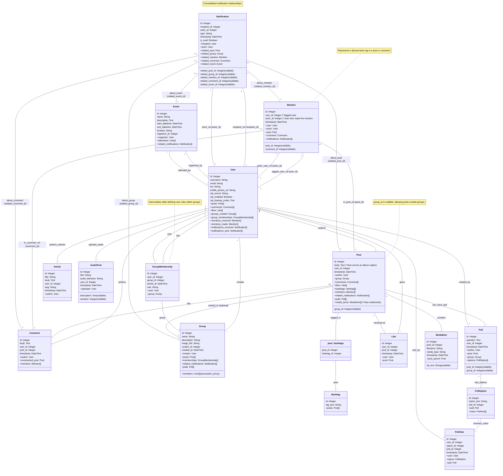

# Flask Social Platform

A social media platform built with Flask, featuring user authentication, profiles, content posting, user following, likes, comments, real-time chat, user tagging/mentions, and a refreshed, modern user interface. The application also includes advanced search, theme customization, and integrations for live streaming and external content sharing (currently in placeholder state).

## Features

*   User registration (username, email, password)
*   User login and logout functionality
*   **Gamification System**: Includes User Levels and Leaderboards to enhance user engagement. ([See Details](#gamification))
*   Secure password hashing (using passlib with sha256_crypt)
*   User profile pages displaying username, email, bio, and profile picture
*   User profile editing:
    *   Update biography
    *   Upload new profile picture (supports JPG, PNG, JPEG)
*   **User Interface & Experience:**
    *   Modern, responsive UI built with Bootstrap 4.5.2 and a custom theme.
    *   Improved visual styling for enhanced readability and aesthetics.
    *   Intuitive navigation and user flows.
    *   **Multi-Language Support (i18n/l10n):** The application supports multiple languages to cater to a diverse user base.
        *   Currently available languages include English and Spanish.
        *   Users can switch their preferred language using a selector in the navigation bar. The selected language is stored in their session.
        *   Implemented using Flask-Babel, with translatable strings marked in templates (using `_()`) and Python code (forms, flash messages using `_l()`).
        *   *Note: Translation files (`.po`, `.mo`) are set up with a dummy structure due to current sandbox limitations preventing `pybabel compile` commands. Full translations will be active once the environment supports these build steps.*
*   **Content Posting & Organization:**
    *   Users can create and share text-based posts.
        *   **Albums/Galleries:** Create posts containing multiple images and/or videos. These are displayed as an interactive Bootstrap carousel if multiple items exist, or as a single media item if only one is uploaded. The post's main text serves as the caption for the entire album/gallery.
        *   **Long-form Articles/Blogs:** Publish detailed articles with rich text formatting using an integrated editor, allowing for more structured and comprehensive content sharing. Articles have unique, viewable URLs.
        *   **Audio Posts/Podcasts:** Share audio content such as podcast episodes or individual audio clips. Uploaded audio files can be played directly on the platform using an HTML5 audio player.
    *   **Content Scheduling:**
        *   Users can schedule their posts and stories to be published at a future date and time. This allows for planning content in advance and automating its release.
        *   **How to Use:**
            *   When creating or editing a post or story, you will find an optional field labeled "Schedule For".
            *   Enter the desired future date and time for publication using the format: `YYYY-MM-DD HH:MM`.
            *   If you leave this field blank, the content will be published immediately.
            *   If a valid future date and time are provided, your content will be automatically published at that time.
        *   **Visibility:**
            *   Scheduled content is not visible to other users until its scheduled publication time.
            *   As the author, you will be able to see your own scheduled content (e.g., on your profile page).
    *   **Hashtag Support:**
        *   Posts can be tagged with hashtags (e.g., `#Flask`, `#PythonTips`) to improve content discoverability.
        *   Hashtags are automatically parsed from the post body.
        *   Clicking on a hashtag displays a feed of all posts associated with that tag.
    *   **Trending Hashtags:** Helps users discover popular and currently discussed topics.
        *   Accessible via a "Trending" link in the main navigation.
        *   Displays a list of trending hashtags, linking to their respective feed pages.
        *   *Current Implementation Note:* This feature is currently simulated by displaying a random sample of available hashtags. Full trend analysis based on usage count and recency is planned for future development once backend environment capabilities allow for robust database migrations and processing.
    *   **User Tagging (Mentions):**
        *   Tag other users in posts and comments using the `@username` syntax.
        *   Autocomplete suggestions for usernames appear while typing `@...`.
        *   Mentions in content are rendered as clickable links to the tagged user's profile.
*   **Following System:**
    *   Users can follow and unfollow other users.
    *   Personalized feed on the homepage displaying posts from followed users and own posts.
*   **Post Engagement & Notifications:**
    *   **Likes & Comments:**
        *   Users can like and unlike posts.
        *   Like counts are displayed for each post.
        *   Users can add comments to posts.
        *   Comments are displayed chronologically under each post, showing the author and timestamp.
    *   **Notification System:** Users receive real-time notifications for:
        *   New likes on their posts.
        *   New comments on their posts.
        *   New followers.
        *   Mentions in their posts or comments.
        *   New chat messages.
        *   **Like Milestones:** Automatic notifications when a user's post reaches specific like count milestones (e.g., 10, 50, 100, 250, 500, 1000 likes), celebrating its popularity.
*   **User Groups/Communities:**
    *   Users can create and join groups based on shared interests, hobbies, or any other criteria.
    *   **Group Creation:** Create new groups with a unique name, description, and an optional group image. The creator automatically becomes an admin.
    *   **Joining & Leaving:** Users can easily join public or discoverable groups and leave groups they are part of.
    *   **Group-Specific Feeds:** Each group has its own dedicated page displaying posts made exclusively within that group, as well as posts shared to the group by its members.
    *   **Group Membership Visibility:** View a list of members for each group.
    *   **Group Management (for Admins):**
        *   Edit group details (name, description, image).
        *   Remove members from the group.
        *   Delete the group entirely (posts within the group will be disassociated).
    *   **Notifications:** Members receive notifications for new posts and shares within their groups, and group admins are notified when new users join.
*   **Real-time Chat:** (See dedicated section below for more details)
    *   One-on-one conversations.
    *   Real-time messaging with Socket.IO.
    *   **Typing Indicators:** See when other users are typing.
    *   **Read Receipts:** "Sent" and "Read" statuses for messages.
    *   Basic emoji support.
*   **Search Functionality (Enhanced):**
    *   Easily find content across the platform using the search bar.
    *   Search results include relevant user profiles, posts, groups, and hashtags.
    *   **Personalized Recommendations:** Displays suggested posts, users, and groups on the search page based on user activity when no search query is active.
    *   **Advanced Filtering:** Filter search results by category (All, Users, Posts, Groups, Hashtags).
    *   **Sorting Options:** Sort results by Relevance, Date, or Popularity (varies by category, e.g., follower count for users, likes/comments for posts).
    *   The search is case-insensitive.

### Personalized Recommendations
To enhance content discovery, the search page now includes a "Recommended for You" section. When authenticated users visit the search page without typing a specific query, the system may suggest:

*   **Recommended Posts**: Posts related to topics and hashtags you've previously engaged with (e.g., through likes and comments).
*   **Suggested Users**: Users you might know or share interests with, based on mutual connections (e.g., people followed by users you follow) or shared group memberships.
*   **Groups You Might Like**: Groups that align with your interests (derived from hashtags of posts you've liked) or are popular among users you follow.

These recommendations are generated based on your activity on the platform and are cached to ensure quick loading. This feature aims to help you discover relevant content and connections more easily.

*   **Stories**:
    *   Share temporary photo or video updates that disappear after 24 hours.
    *   Users can create new stories with media and captions via the `/story/create` page.
    *   View a feed of active stories from followed users and own stories on the `/stories` page, styled with custom CSS and basic JS interaction.
*   **Polls & Surveys**:
    *   Create interactive polls to gather opinions. Polls include a question and multiple customizable options.
    *   Users can vote on polls (AJAX-based), with logic to prevent multiple votes or allow changing a vote. Poll results are displayed with vote counts and percentages.
    *   Polls can be standalone, contextually linked to groups (e.g., created from a group page or when creating a post for a group), or conceptually linked to posts.
    *   Notifications are sent for new polls to relevant users (group members or followers).

#### Real-Time Poll Results
To enhance interactivity, poll results now update in real-time. When a user votes, or when other users vote on the same poll, the vote counts and percentages dynamically refresh on the page without requiring a manual reload. This live update functionality is powered by SocketIO, providing immediate feedback and a more engaging user experience. To make these updates more noticeable, a subtle visual animation highlights the vote counts as they change. Additionally, polls now display a live count of users currently viewing them, providing a sense of real-time engagement.

### Post Sharing
- Users can share posts from other users to their own personal feed.
- **Sharing to Groups:** Posts can also be shared directly to groups that the user is a member of.
    - When a post is shared to a group, it appears in the group's dedicated feed, intermingled with direct posts to the group, sorted chronologically.
    - The shared post is clearly attributed with "Shared by [User] on [Timestamp]" above the original post content.
    - Members of the group (excluding the sharer) receive a notification when a new post is shared to the group.
- When a post is shared (either to a personal feed or a group), a `Share` record is created, linking the sharer, the original post, and (if applicable) the target group.
- The original author of the post receives a notification when their post is shared (regardless of whether it was to a personal feed or a group, unless they are the one sharing their own post).
- Shared posts on personal feeds are attributed to the user who shared them and are ordered chronologically based on the share time.
- This functionality is implemented via the `Share` model, a `POST /post/<post_id>/share` route (which now accepts an optional `group_id`), a "Share" button on posts, and updates to feed generation logic for both personal and group feeds.
*   CSRF Protection for forms.
*   Default profile picture for new users.
*   Unit tests for core features including authentication, profiles, posts, groups, chat, search, stories, and polls.

### Events/Calendar
*   **Purpose:** Allows users to create, discover, join, and manage events, fostering real-world interactions and community engagement.
*   **Key Functionalities:**
    *   Create new events with details such as name, description, start/end date & time, and location.
    *   View a comprehensive list of all upcoming and past events.
    *   Access detailed information for each specific event.
    *   Users can join events they are interested in and leave events they can no longer attend.
    *   Event organizers have the ability to edit or delete the events they've created.
    *   Attendees and organizers receive notifications for important event updates, cancellations, and when new users join an event.
    *   **External Calendar Integration:**
        *   Users can easily export event details to their preferred external calendar application (e.g., Google Calendar, Outlook, Apple Calendar).
        *   This is done by downloading an industry-standard .ics file directly from the event's detail page.
        *   To use, simply click the "Add to Calendar" button on an event page. This will download the .ics file, which can then be imported into most calendar programs.

## Advanced Analytics Dashboard

The application now features an enhanced analytics dashboard, providing users with deeper insights into their content performance and audience engagement over time.

Key features include:

*   **Historical Engagement Trends**: Track your likes, comments, and follower counts over various time periods (last 7 days, 30 days, 90 days, or all time). These trends are visualized using interactive line charts.
*   **Content Performance by Context**:
    *   **Top Hashtags**: Identify which hashtags associated with your posts drive the most engagement (likes and comments).
    *   **Top Groups**: Analyze the performance of your posts within different groups to see which communities are most interactive with your content.
*   **Data Export**: Download your analytics data, including summary statistics, historical trends, and top-performing content contexts, in CSV format for offline analysis or record-keeping.

The dashboard utilizes Chart.js for dynamic data visualizations and employs a daily scheduled task (via APScheduler) to collect and update historical analytics data.

## Performance Optimizations

To enhance the user experience and ensure the platform runs efficiently, several performance optimization techniques have been implemented:

*   **Caching:**
    *   **Flask-Caching** is utilized for server-side caching.
    *   An **in-memory cache (`SimpleCache`)** is primarily used, suitable for single-instance deployments. For multi-instance deployments, a distributed cache like Redis or Memcached would be recommended.
    *   **Cached Components:**
        *   **Routes:** Several frequently accessed routes, such as the main index page (`/`), user profiles (`/user/<username>`), and group view pages (`/group/<group_id>`), are cached to reduce database load and response times. Timeouts are configured based on the expected rate of change for the content (e.g., 5 minutes for general feeds, 1 hour for user profiles).
        *   **Database Queries:** Specific database query results, like the `followed_posts()` method in the `User` model, are cached to avoid redundant database hits for common data retrievals.
        *   Cache invalidation is implemented where necessary, for example, a user's profile cache is cleared when their profile information is updated.

*   **Database Optimization:**
    *   **Indexes:** Strategic database indexes have been added to frequently queried columns in models like `Post` (e.g., `user_id`), `Notification` (e.g., `recipient_id`, `actor_id`), and `ChatMessage` (e.g., `conversation_id`, `sender_id`). This significantly speeds up data retrieval operations.
    *   **Query Optimization:** The `followed_posts()` method, which generates the main feed for authenticated users, has been optimized to use efficient SQL joins and now supports pagination to load data in manageable chunks.
    *   **User Analytics Table:** A dedicated `UserAnalytics` table has been introduced to store pre-calculated aggregates like total likes and comments received by each user. This avoids expensive on-the-fly calculations on high-traffic pages like user profiles or analytics dashboards. These analytics are updated periodically (currently via a manual trigger, but designed for a scheduled task).

*   **Image and Media Handling:**
    *   **Image Compression:** The **Pillow** library is used to compress uploaded images.
        *   Profile pictures are resized to 256x256 pixels.
        *   Post images are resized if they exceed a maximum width (currently 800px), maintaining aspect ratio.
        *   All processed images are saved with optimization flags and a quality setting of 85% to balance file size and visual quality.
    *   **Lazy Loading:** `` tags across various templates (posts, profiles, group pages, stories, search results) now use the `loading="lazy"` attribute. This native browser feature defers the loading of off-screen images until the user scrolls near them, improving initial page load times and reducing bandwidth consumption.
    *   **Video Preloading:** For videos in stories, the `preload="metadata"` attribute is used on `<video>` tags, which instructs the browser to load only the video's metadata (like dimensions and duration) initially, rather than the entire video file.

These optimizations contribute to a faster, more responsive, and scalable platform.

## `pymath` Mathematics Library

The project includes a utility library named `pymath` for mathematical operations. Recently, this library has been significantly enhanced with a symbolic mathematics module.

### `pymath.symbolic` - Symbolic Mathematics

The `pymath.symbolic` module provides tools for symbolic computation, allowing for the representation and manipulation of mathematical expressions rather than just numerical values. This can be a powerful tool for features requiring algebraic manipulation, calculus, or complex formula handling.

**Key Capabilities:**

*   **Symbolic Variables and Constants:**
    *   Define variables (e.g., `x`, `y`) and constants that can be used in expressions.
    *   Example:
        ```python
        from pymath.symbolic.expression import Variable, Constant
        x = Variable('x')
        y = Variable('y')
        c = Constant(5)
        ```

*   **Expression Building:**
    *   Construct complex mathematical expressions using standard Python operators.
    *   Example:
        ```python
        expr = (x**2 + Constant(2)*x*y + y**2) / (x - y)
        print(expr)  # Output: (((x ** 2) + ((2 * x) * y)) + (y ** 2)) / (x - y))
        ```

*   **Automatic Simplification:**
    *   Basic algebraic simplifications are applied automatically during expression creation.
    *   Examples:
        ```python
        expr_sum_zero = x + Constant(0)
        print(expr_sum_zero)  # Output: x

        expr_mul_one = y * Constant(1)
        print(expr_mul_one)   # Output: y

        expr_const_fold = Constant(2) + Constant(3)
        print(expr_const_fold) # Output: 5
        ```

*   **Evaluation:**
    *   Substitute numerical values for variables to evaluate expressions.
    *   Example:
        ```python
        result = expr.eval(x=10, y=2)
        # ((10^2 + 2*10*2 + 2^2) / (10-2)) = (100 + 40 + 4) / 8 = 144 / 8 = 18
        print(result)  # Output: 18.0
        ```

*   **Differentiation:**
    *   Perform symbolic differentiation with respect to a variable.
    *   Supports common differentiation rules (sum, product, quotient, power, chain rule for log/exp).
    *   Example:
        ```python
        from pymath.symbolic.expression import Log

        # Differentiate x^3 + 2x + log(x) with respect to x
        expr_to_diff = x**Constant(3) + Constant(2)*x + Log(x)
        diff_expr = expr_to_diff.diff(x)
        # Expected: 3*(x**2) + 2 + (1/x)
        print(diff_expr) # Output: (((3 * (x ** 2)) + 2) + (1 / x)) (or similar based on internal structure)
        ```

This module is tested via unit tests in `app/libs/pymath/tests/test_symbolic.py`. It can be leveraged for future features requiring advanced mathematical processing within the platform.

## Real-time Chat

The platform includes a real-time chat feature allowing users to engage in one-on-one conversations.

**Key Chat Features:**

*   **One-on-one Conversations:** Users can initiate private chats with other users.
*   **Real-time Messaging:** Messages are sent and received instantly without needing to refresh the page, powered by Flask-SocketIO.
*   **Typing Indicators:** Users can see when the other person in the conversation is typing a message.
*   **Read Receipts:** Sent messages display "✓ Sent" status, which updates to "✓ Read" when the recipient has viewed the message.
*   **Emoji Support (Basic):** A simple emoji picker allows users to insert common emojis into their messages.
*   **Message History:** Past messages in a conversation are loaded and displayed.
*   **Notifications:** New chat messages trigger real-time notifications for the recipient (integrated with the existing notification system).

**Chat Screenshots:**

*   **Conversation List View:**
    `[Screenshot of Conversation List]`
    *Description: Shows a list of active conversations for the logged-in user, typically ordered by the most recent activity.*

*   **Chat View:**
    `[Screenshot of Chat View]`
    *Description: Displays the message history with another user. Features include dynamically grouped messages, typing indicators when the other user is active, and read receipts for sent messages.*

*   **Chat View with Emoji Panel Open:**
    `[Screenshot of Chat View with Emoji Panel]`
    *Description: Shows the emoji panel open, allowing users to easily select and insert emojis into their chat messages.*

## Frontend Technologies & Styling

The frontend of this platform is built using:

*   **Flask Templates (Jinja2):** For dynamic HTML rendering.
*   **Bootstrap 4.5.2:** As the core CSS framework for layout, components, and responsiveness. Bootstrap is integrated via CDN.
*   **Custom Modern Theme:** Applied via `app/static/css/style.css`, this theme includes:
    *   A unique color palette.
    *   The "Lato" Google Font for typography.
    *   Customized styling for Bootstrap components (cards, buttons, forms) to create a distinct look and feel.
*   **JavaScript & Socket.IO Client:** For real-time features like chat, notifications, typing indicators, and read receipts.

## Screenshots

*(Coming Soon: The following screenshots will demonstrate key features of the application.)*

*   User Registration and Login
*   User Profile Page
*   Content Feed
*   Creating a Post
*   Post Engagement
*   *(Chat screenshots are now in the dedicated "Real-time Chat" section)*

## Potential Future Developments

While the platform is already rich in features, here are some exciting ideas for future enhancements:

*   **Related Posts:**
    *   Implement a system to suggest related posts to users, either at the bottom of a post they are viewing or in a dedicated section.
    *   This could be based on shared tags, content similarity (e.g., using TF-IDF or other NLP techniques), or user engagement patterns.
*   **Post Reactions:**
    *   Expand beyond simple "likes" to include a range of reactions (e.g., "love," "haha," "wow," "sad," "angry").
    *   This would allow for more nuanced user expression and feedback on content.
*   **Rate Limiting:**
    *   Introduce rate limiting for various actions (e.g., login attempts, post creation, comment submission, API requests) to improve security and prevent abuse.
    *   This could be implemented using Flask-Limiter or a similar extension.
*   **Enhanced Content Discovery:**
    *   Further improve algorithms for personalized recommendations and trending content.
*   **Full Media Server Recording Playback:**
    *   Develop the functionality to access and play back recorded live streams.
*   **Advanced Group Moderation Tools:**
    *   Provide group admins with more tools for managing content and members.

## Getting Started

Follow these instructions to get a copy of the project up and running on your local machine for development and testing purposes.

### Prerequisites

*   Python 3.8 or higher
*   pip (Python package installer)
*   git (for cloning the repository)

### Setup

1.  **Clone the repository**:
    ```bash
    git clone <your_repository_url_here>
    cd <repository_directory_name>
    ```
    *(Replace `<your_repository_url_here>` and `<repository_directory_name>` with the actual URL and directory name if you are cloning this from a remote repository. If working locally, you can skip this step or adjust as needed.)*

2.  **Create and activate a virtual environment**:
    ```bash
    python3 -m venv venv
    ```
    On Linux/macOS:
    ```bash
    source venv/bin/activate
    ```
    On Windows:
    ```bash
    venv\Scriptsctivate
    ```

3.  **Install dependencies**:
    Make sure your virtual environment is activated, then run:
    ```bash
    pip install -r requirements.txt
    ```

4.  **Configuration (Optional)**:
    *   The application uses configurations defined in `config.py`.
    *   A default `SECRET_KEY` is provided for development. For production, this should be set to a secure, random value, preferably via an environment variable.
    *   The database is configured to use SQLite (`app.db`) by default. The `SQLALCHEMY_DATABASE_URI` in `config.py` can be modified to use other databases like PostgreSQL or MySQL.
    *   The `UPLOAD_FOLDER` for profile pictures is set to `app/static/images/`.
    *   `POST_IMAGES_UPLOAD_FOLDER` for images attached to posts is `app/static/post_images/`.
    *   `VIDEO_UPLOAD_FOLDER` for videos attached to posts is `app/static/videos/`.
    *   `MEDIA_ITEMS_UPLOAD_FOLDER` for media files in albums/galleries (e.g., `app/static/media_items/`). This path can be customized in `config.py`.
    *   `AUDIO_UPLOAD_FOLDER` for audio post files (e.g., `app/static/audio_uploads/`). This path can be customized in `config.py`.
    *   `UPLOAD_FOLDER_GROUP_IMAGES` for group images is `app/static/group_images/`.
    *   `STORY_MEDIA_UPLOAD_FOLDER` for story media (images/videos) is `app/static/story_media/`. This path can be customized in `config.py` (defaults are provided).

### Running the Application

1.  Ensure your virtual environment is activated.
2.  From the project root directory, run the application:
    ```bash
    python3 run.py
    ```
3.  The application will typically be available at `http://127.0.0.1:5000/`. Open this URL in your web browser.

### Running Tests

1.  Ensure your virtual environment is activated and development dependencies are installed.
2.  From the project root directory:
    *   To run all main application tests:
        ```bash
        python3 -m unittest discover tests
        ```
        This command will discover and run all tests located in the `tests/` directory and its subdirectories.
    *   To run tests for a specific part of the application (e.g., core tests):
        ```bash
        python3 -m unittest discover tests/core
        ```
    *   Similarly, for API tests:
        ```bash
        python3 -m unittest discover tests/api
        ```
    *   To run the `pymath` library tests:
        ```bash
        python3 -m unittest discover -s app/libs/pymath/tests -p 'test_*.py'
        ```

## Project Structure
```
/
├── app/                  # Main application package
│   ├── core/             # Core application logic
│   │   ├── forms.py      # WTForms definitions
│   │   ├── models.py     # SQLAlchemy database models
│   │   ├── routes.py     # Main application routes (views)
│   │   ├── events.py     # Socket.IO event handlers
│   │   └── scheduler.py  # APScheduler setup
│   ├── admin/            # Admin interface specific logic
│   │   └── routes.py     # Admin routes
│   ├── api/              # API specific logic
│   │   └── routes.py     # API routes
│   ├── auth/             # Authentication specific logic (e.g., forms, routes)
│   │   └── ...           # (Currently empty, add specific files once they exist)
│   ├── utils/            # Utility functions
│   │   ├── helpers.py    # General helper functions
│   │   └── email.py      # Email sending utilities
│   ├── static/           # Static files (CSS, JS, images)
│   │   ├── css/
│   │   ├── js/
│   │   ├── images/       # User profile pictures
│   │   ├── post_images/  # Images attached to posts
│   │   ├── videos/       # Videos attached to posts
│   │   ├── media_items/  # Files for album/gallery posts
│   │   ├── audio_uploads/ # Uploaded audio files
│   │   ├── group_images/ # Group profile images
│   │   └── story_media/  # Media for stories
│   ├── templates/        # HTML templates
│   │   ├── chat/
│   │   └── ...           # Other template files and subdirectories
│   ├── translations/     # Language translations
│   └── __init__.py       # Application factory, initializes Flask app and extensions
├── tests/                # Unit tests
│   ├── core/             # Tests for core application logic
│   │   ├── test_posts.py
│   │   ├── test_forms.py
│   │   └── ...           # Other core tests
│   ├── admin/            # Tests for admin functionalities
│   │   └── .gitkeep      # (Empty for now)
│   ├── api/              # Tests for API endpoints
│   │   ├── test_api_auth.py
│   │   └── ...
│   ├── auth/             # Tests for authentication logic
│   │   ├── test_auth.py
│   │   └── test_2fa.py
│   ├── utils/            # Tests for utility functions
│   │   ├── test_helpers.py
│   │   └── test_image_utils.py
│   └── __init__.py       # Test package initializer
├── app.db                # SQLite database file
├── config.py             # Configuration settings
├── migrations/           # Database migration scripts
├── requirements.txt      # Python package dependencies
├── run.py                # Script to run the Flask development server
└── README.md             # This file
```
*(Note: Project structure updated to reflect mention-related files/updates, corrected static asset paths, and consolidated test descriptions.)*

## Usage Highlights

*   **Creating a Story**: Navigate to `/story/create` (e.g., via the "Create a Story" button on the `/stories` page). Upload your media and add an optional caption.
*   **Viewing Stories**: Visit the `/stories` page to see a feed of currently active stories from users you follow and your own.
*   **Creating a Poll**:
    *   **Standalone Poll**: On the "Create Post" page (when not targeting a specific group), you'll find a link "Create a Standalone Poll Instead?" which leads to `/poll/create`.
    *   **Group-Specific Poll**: On a group's page, use the "Create Poll in this Group" button. Alternatively, when creating a post for a group, a link "Create a Poll in {{ group_name }} Instead?" will be available. Both will pre-fill the group context for the poll.
*   **Voting on Polls**: Polls associated with posts will appear directly within the post's display. If you haven't voted, you can select an option and submit your vote via AJAX. Results update dynamically (currently on page reload after AJAX vote).
*   **Tagging Users (Mentions)**: When creating or editing a post, or when adding a comment, type `@` followed by the username (e.g., `@exampleuser`). An autocomplete suggestions list will appear to help you select the correct user. Clickable mentions in displayed content will navigate to the user's profile.

## Contributing

We welcome contributions to the Flask Social Platform! Here are some ways you can contribute:

*   **Reporting Bugs:** If you find a bug, please open an issue on our issue tracker. Include as much detail as possible:
    *   Steps to reproduce the bug.
    *   Expected behavior.
    *   Actual behavior.
    *   Your environment (e.g., browser, OS).
*   **Suggesting Enhancements:** If you have an idea for a new feature or an improvement to an existing one, please open an issue to discuss it.
*   **Pull Requests:** We are happy to review pull requests. To make the process smoother:
    1.  Fork the repository.
    2.  Create a new branch for your feature or bug fix (`git checkout -b feature/your-feature-name` or `git checkout -b fix/your-bug-fix`).
    3.  Make your changes.
    4.  Ensure your code adheres to any existing style guidelines (if we establish them).
    5.  Write tests for your changes if applicable.
    6.  Ensure all tests pass (`python3 -m unittest discover tests`).
    7.  Commit your changes with a clear and descriptive commit message.
    8.  Push your branch to your fork (`git push origin feature/your-feature-name`).
    9.  Open a pull request against our `main` (or `develop`) branch.

We'll do our best to review contributions in a timely manner.

## New and Enhanced Features Overview

Beyond the core functionalities listed above, recent developments have introduced several advanced features:

*   **Enhanced Direct Messaging:** The real-time chat system now includes typing indicators and read receipts, providing a more interactive messaging experience. (Details in the "Real-time Chat" section).
*   **Advanced Search & Discovery:** The search functionality has been upgraded to allow filtering by specific categories (Users, Posts, Groups, Hashtags) and sorting results by relevance, date, or popularity, making it easier to find exactly what you're looking for.
*   **External Content Sharing (Placeholder):**
    *   Functionality to share posts to external platforms like Twitter and Facebook has been initiated.
    *   Users can (simulate) connecting their Twitter/Facebook accounts via OAuth placeholders in their profile settings.
    *   "Share on Twitter" and "Share on Facebook" buttons are available on posts.
    *   *Note: Actual API integration for sharing is a placeholder and not yet functional.*
### Live Streaming (Enhanced with Media Server)

The platform features an enhanced live streaming capability, moving beyond basic P2P WebRTC to a more scalable solution using a media server.

*   **Scalable Architecture (SFU Model)**:
    *   Integrates with a media server (e.g., **Janus Gateway**) acting as a Selective Forwarding Unit (SFU).
    *   The broadcaster sends a single stream to the SFU, which then efficiently relays it to all viewers. This significantly improves scalability for larger audiences compared to P2P.
    *   The system still uses WebRTC for real-time communication, ensuring compatibility with modern browsers.
*   **STUN/TURN Servers**:
    *   Utilizes a public STUN server (e.g., Google's `stun:stun.l.google.com:19302`) for NAT traversal.
    *   Requires a **TURN server** (e.g., Coturn) to be configured and available for robust connectivity, especially in complex network scenarios like symmetric NATs. The application must be configured with the TURN server's URL and credentials.
*   **Stream Recording**:
    *   Leverages the media server (Janus) for server-side stream recording.
    *   Broadcasters can choose to have their streams recorded.
    *   Recorded streams are intended to be stored (e.g., in `app/static/stream_recordings/`) and linked to the `LiveStream` model via a `recording_filename`.
    *   *(Note: The mechanism for accessing/playing back recordings is a future enhancement.)*
*   **Real-Time Chat Integration**:
    *   The stream viewing page now includes a dedicated real-time chat panel.
    *   Each live stream has its own chat room, allowing viewers and the broadcaster to interact during the broadcast.
    *   This uses the existing Flask-SocketIO chat infrastructure, associating messages with a stream-specific conversation.
*   **Error Handling and Connection Recovery (Client-Side)**:
    *   Client-side JavaScript includes logic to detect connection drops to the media server and will attempt reconnection, providing UI feedback to the user.

**Dependencies for Enhanced Live Streaming:**

*   **Janus Media Server**: A running instance of Janus Gateway, configured with the VideoRoom plugin (for SFU functionality) and the RecordPlay plugin (if using its recording capabilities directly). The application needs its URL (`JANUS_SERVER_URL` in `config.py`).
*   **Coturn (or other TURN Server)**: A running TURN server for reliable NAT traversal. The application needs its URL and credentials (`TURN_SERVER_URL`, `TURN_SERVER_USERNAME`, `TURN_SERVER_CREDENTIAL` in `config.py`).

This enhanced setup addresses the scalability limitations of the previous P2P WebRTC implementation and adds valuable features like recording and integrated chat.
*   **Customizable User Themes:**
    *   Users can now personalize their viewing experience by selecting a site theme.
    *   Options include "Default," "Dark Theme," and "Blue Lagoon Theme."
    *   Theme selection is available in the "Edit Profile" page.
    *   The chosen theme is applied globally via theme-specific CSS files.

## Gamification

The platform includes a gamification system to enhance user engagement and provide a sense of progression and friendly competition.

#### User Levels
Engage with the platform to earn points and climb through user levels!
-   **Earning Levels**: Levels are achieved by accumulating experience points (XP) through various activities such as posting content, daily logins, and interacting with the community.
-   **Level Display**: Your current level is displayed on your profile page, showcasing your progress and dedication.
-   **Level-Up Notifications**: You'll receive a notification each time you advance to a new level.
-   **New Badges**: Special badges like "Gamer" (Level 5) and "Veteran" (Level 10) can be unlocked as you reach new level milestones.

#### Leaderboards
Compete with other users and see who's leading the community!
-   **Access**: The Leaderboard is accessible via a link in the main navigation bar.
-   **Rankings**: Users are ranked based on points earned. The leaderboard displays each user's rank, profile picture, username (linked to their profile), current level, and score for the selected period.
-   **Time Periods**: You can view leaderboards for different timeframes:
    *   **All-Time**: Shows rankings based on total accumulated points.
    *   **Monthly**: Shows rankings based on points earned during the current month.
    *   **Weekly**: Shows rankings based on points earned during the current week.
    *   **Daily**: Shows rankings based on points earned today.

## Data Model for Engagement Features (Mermaid Diagram)



## Security Features

### Two-Factor Authentication (2FA)
To enhance account security, Two-Factor Authentication (2FA) via TOTP (Time-based One-Time Passwords) is implemented.
*   **Setup:** Users can enable 2FA in their profile settings. The setup process involves:
    *   Displaying a QR code for easy scanning with authenticator apps (e.g., Google Authenticator, Authy).
    *   Providing the secret key for manual entry if QR scanning is not possible.
    *   Generating a set of 10 one-time backup codes for account recovery if the authenticator device is unavailable. These codes should be stored securely by the user.
*   **Login:** When 2FA is enabled, after successful password verification, the user is prompted to enter a 6-digit code from their authenticator app or one of their backup codes to complete the login.
*   **Management:** Users can manage their 2FA settings via their profile:
    *   **Disable 2FA:** Requires confirming identity with the current password and a valid TOTP code.
    *   **Regenerate Backup Codes:** Allows users to generate a new set of backup codes (invalidating all previous ones), also requiring password and TOTP confirmation.

## Dark Mode

This application now supports a Dark Mode theme for improved readability in low-light environments and user preference.

### How to Toggle Dark Mode
-   You can switch between Light and Dark Mode using the toggle switch located in the navigation bar.
-   Your preference is saved locally in your browser.
-   If you are a logged-in user, your theme preference will also be saved to your account and applied automatically on your next visit from any browser.
